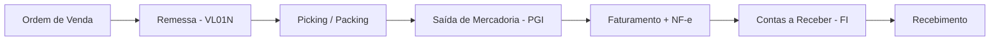

**Também conhecido como:** `O2C` · `OTC` · `Pedido ao Recebimento`

> **Definição**
> Ciclo de receita: pedido do cliente → ordem de venda → entrega → faturamento → recebimento.
{.is-info}

Integra SD com MM (estoque), PP (produção), LE (logística) e FI/CO (finanças).

## 🔗 Relacionados
- [SD](/glossario/sd)
- [Ordem de Venda](/glossario/ordem-de-venda)
- [Outbound Delivery](/glossario/outbound-delivery)
- [PGI](/glossario/pgi)
- [Faturamento](/glossario/faturamento)
- [Procure-to-Pay](/glossario/procure-to-pay)

## 📚 Fontes
- Apostila - Consultor SAP (Final) - SD, BTP e Carreira
- Apostila - Consultor SAP (Dia 1) - Ecossistema e Soft Skills

---
🧭 [Módulos Funcionais SAP](/glossario/temas/modulos-funcionais-sap) · [Glossário SAP A-Z](/glossario/a-z) · [Glossário SAP](/glossario)
