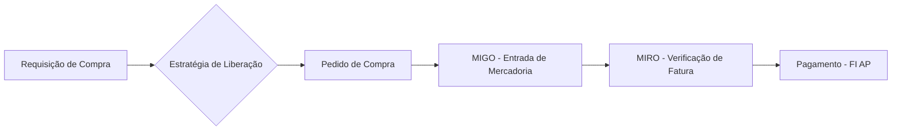

**Também conhecido como:** `P2P` · `Source-to-Pay` · `Compra ao Pagamento`

> **Definição**
> Ciclo ponta a ponta de suprimentos: da necessidade de compra até o pagamento do fornecedor.
{.is-info}

## 🔗 Relacionados
- [MM](/glossario/mm)
- [Requisição de Compra](/glossario/requisicao-de-compra)
- [Pedido de Compra](/glossario/pedido-de-compra)
- [MIGO](/glossario/migo)
- [MIRO](/glossario/miro)
- [Order-to-Cash](/glossario/order-to-cash)

## 📚 Fontes
- Apostila - Consultor SAP (Dia 4) - Suprimentos MM e EWM

---
🧭 [Módulos Funcionais SAP](/glossario/temas/modulos-funcionais-sap) · [Glossário SAP A-Z](/glossario/a-z) · [Glossário SAP](/glossario)
