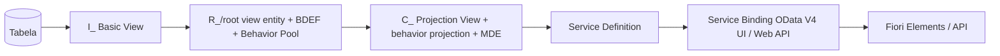

**Também conhecido como:** `ABAP RAP` · `RESTful Application Programming Model` · `ABAP RESTful Application Programming Model`

> **Definição**
> Modelo de programação estratégico da SAP para construir serviços OData transacionais e apps Fiori cloud-ready no S/4HANA e na BTP, com CDS + behavior + serviço.
{.is-info}

> **Regra de ouro (DSAG)**
> O RAP deve ser a **primeira escolha incontestável** para apps transacionais Fiori Elements e APIs no S/4HANA. Substitui SEGW + BOPF + Dynpro por um framework único ponta a ponta (tabela HANA → OData V2/V4 → Fiori Elements / Web API / InA).
{.is-warning}

**Características (ABAP for Cloud Development):** cloud-ready (BTP, S/4HANA Cloud public/private e on-premise) · upgrade-stable (só objetos liberados) · orientado à arquitetura (separa dados, lógica e serviço) · à prova de futuro.

**Os 3 pilares de um Business Object:**
| Pilar | Tecnologia | Função |
|---|---|---|
| 1. Modelo de dados | [CDS](/glossario/cds-view) (root view entity, composições) | Estrutura das entidades e relações |
| 2. Lógica de negócio | [BDEF/BDL](/glossario/behavior-definition) + [Behavior Pool](/glossario/behavior-pool) (ABAP) | Operações, ações, validações, determinações, locks |
| 3. Exposição | [Service Definition + Binding](/glossario/service-definition-e-service-binding) | OData para Fiori ou Web API |

**Runtime:** requisição OData → **SAP Gateway** (tradutor de protocolo) → **RAP Runtime Engine** (orquestrador: buffer, locks, validações, determinações) → implementações do BO.

**Cadeia de artefatos (DSAG):** tabela → `I_` basic → `R_` restricted/root (composition tree + behavior) → `C_` projection/consumption (+ behavior projection) → SRVD → SRVB → app Fiori.

**Tópicos:** [Managed x Unmanaged](/glossario/managed-x-unmanaged) · [Transação RAP](/glossario/transacao-rap) · [locking e ETag](/glossario/controle-de-concorrencia-rap) · [Determinations e Validations](/glossario/determinations-e-validations) · [Actions RAP](/glossario/actions-rap) · [Feature Control RAP](/glossario/feature-control-rap) · [Draft RAP](/glossario/draft-rap) · [Business Events RAP](/glossario/business-events-rap) · [Extensibilidade RAP](/glossario/extensibilidade-rap) · [Service Consumption Model](/glossario/service-consumption-model) · [unmanaged query](/glossario/custom-entity) · [Workflow e Change Documents RAP](/glossario/workflow-e-change-documents-rap) · [ABAP Flight Reference Scenario](/glossario/abap-flight-reference-scenario).

**Armadilhas (DSAG):** o RAP evoluiu radicalmente a cada release — releases 1909/2020 têm limitações; leia a matriz de recursos da sua versão; prefira Fiori Elements a freestyle; teste o behavior pool com ABAP Unit; libere artefatos RAP para permitir *behavior extensions* (2022+).

**Futuro (2024/2025):** geração com Joule ("OData UI Service from Scratch"), collaborative draft, tree views e analytical tables, draft scope cross-BO.

**Documentação:** ABAP RESTful Application Programming Model Guide (SAP Help), F1 no ADT (ABAP Keyword Documentation), developers.sap.com e o repositório GitHub `SAP-samples/abap-platform-refscen-flight`.

## 🔗 Relacionados
- [Business Object RAP](/glossario/business-object-rap)
- [Behavior Definition](/glossario/behavior-definition)
- [Behavior Pool](/glossario/behavior-pool)
- [EML](/glossario/eml)
- [Service Definition e Service Binding](/glossario/service-definition-e-service-binding)
- [CDS View](/glossario/cds-view)
- [ABAP Cloud](/glossario/abap-cloud)
- [Fiori Elements](/glossario/fiori-elements)
- [BOPF](/glossario/bopf)

## 📚 Fontes
- Apostila - ABAP RAP
- Apostila - DSAG ABAP Leitfaden 2026 (Parte 2)
- Apostila - Conhecendo todos os Módulos do SAP
- Apostila - Consultor SAP (Final) - SD, BTP e Carreira
- Apostila - Padrão Wrapper para BAPIs
- Apostila - Desmistificando o BOPF

---
🧭 [ABAP RAP](/glossario/temas/abap-rap) · [Glossário SAP A-Z](/glossario/a-z) · [Glossário SAP](/glossario)
